# 📡 Combined WiFi & Cellular Network Analysis
This project analyzes **WiFi and Cellular networks** using:  
- 📦 Packet-level traffic from Wireshark  
- ⚡ Real-time internet speed tests with speedtest-cli  
- 📊 Visualizations showing trends and performance distribution  
All functionalities are implemented in **one Jupyter Notebook** for simplicity and reproducibility.

## 🔧 Technologies Used
- Python: pandas, matplotlib, seaborn  
- speedtest-cli: real-time speed measurement  
- Wireshark: packet data capture  
- Google Colab: execution environment

## 📂 Repository Structure
.
├── images/
│   ├── WifiPacketLengthVariation.png
│   ├── CellularPacketLengthVariation.png
│   ├── DownloadspeedWIFI.png
│   ├── UploadSpeedWIFI.png
│   ├── pingWIFI.png
│   ├── networkSpeedPerformanceWIFI.png
│   ├── pingPerformanceWIFI.png
│   ├── DownloadspeedCellular.png
│   ├── UploadSpeedCELLULAR.png
│   ├── pingCELLULAR.png
│   ├── networkSpeedPerformanceCELLULAR.png
│   └── pingPerformanceCELLULAR.png
├── Combined_Network_Analysis.ipynb
├── wifi_data.csv
├── cellular_data.csv
├── network_speed_log.csv
├── cellular_speed_log.csv
└── README.md

## 📶 WiFi Network Analysis
### 📉 Packet Length Over Time  
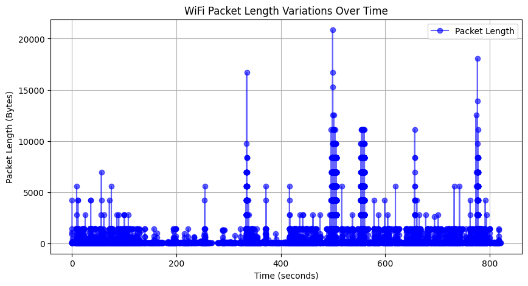  
### ⬇️ Download Speed  
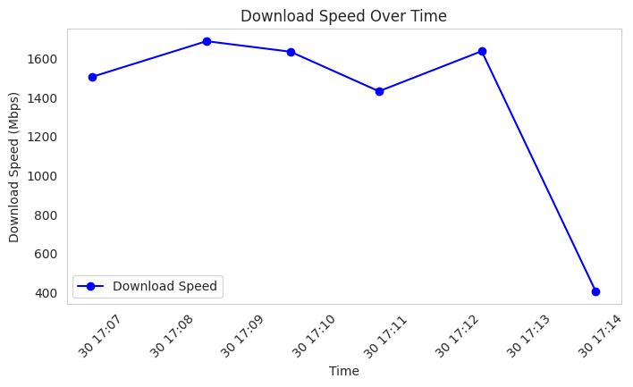  
### ⬆️ Upload Speed  
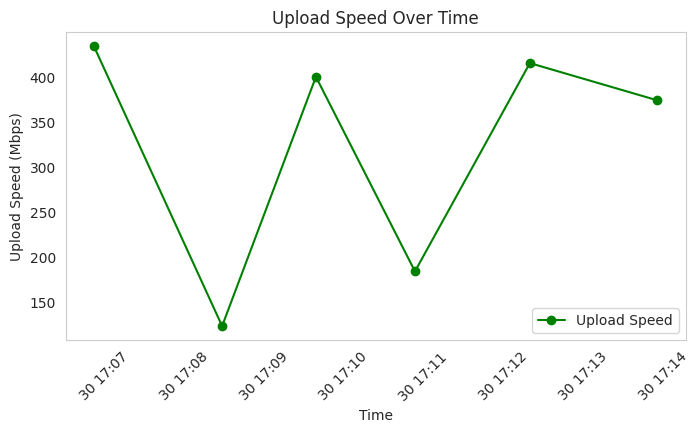  
### ⚡ Ping  
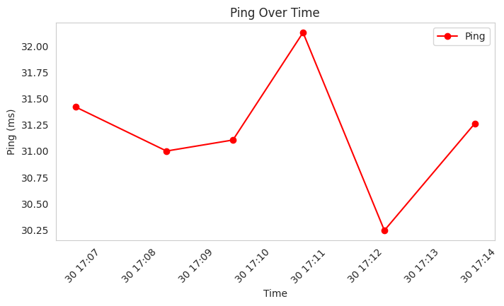  
### 📦 Speed Performance Distribution  
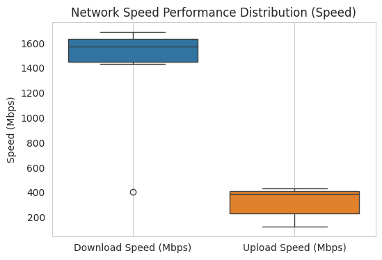  
### 📦 Ping Performance Distribution  
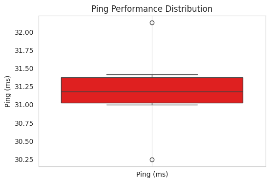  

## 📱 Cellular Network Analysis
### 📉 Packet Length Over Time  
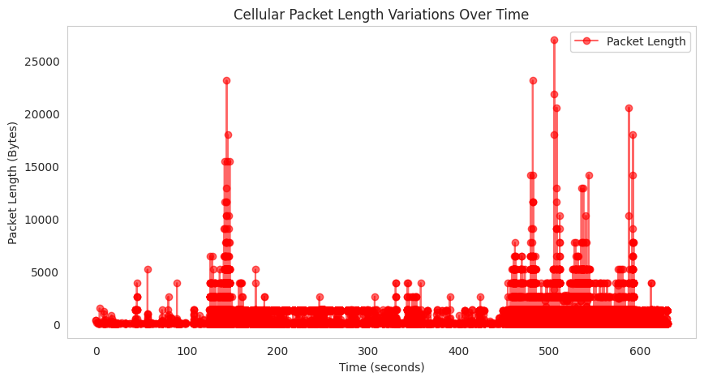  
### ⬇️ Download Speed  
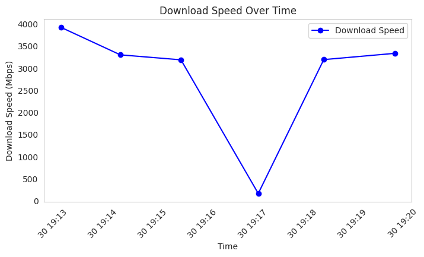  
### ⬆️ Upload Speed  
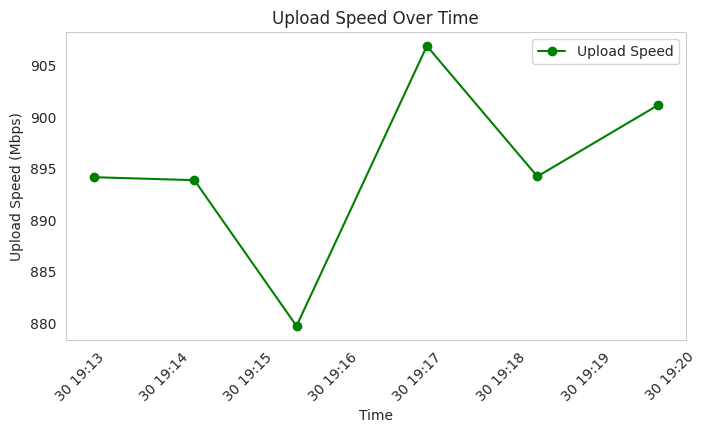  
### ⚡ Ping  
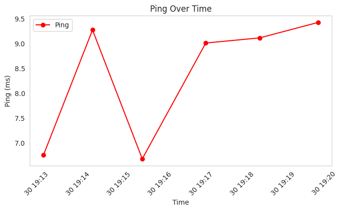  
### 📦 Speed Performance Distribution  
  
### 📦 Ping Performance Distribution  
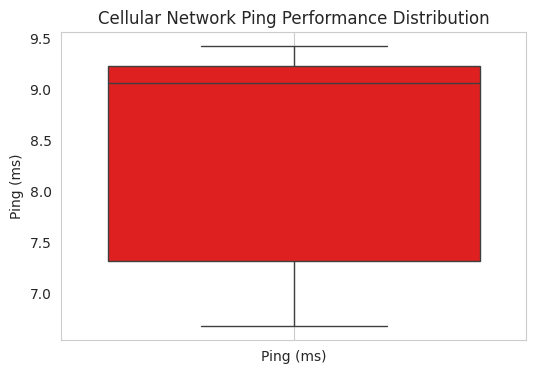  

## 📝 How to Run
1. Clone this repo or open it in Google Colab  
2. Upload the required CSV files or generate them using the notebook  
3. Install required packages:  
pip install speedtest-cli pandas matplotlib seaborn  
4. Run the Combined_Network_Analysis.ipynb notebook  

## 🚀 Features
- 🔁 Automated speed tests with random intervals  
- ⏱️ Download / Upload / Ping logging  
- 📊 Packet-level time-series visualization  
- 📦 Boxplots for performance comparison  

## 📌 Potential Enhancements
- Add protocol classification (DNS, TCP, UDP breakdown)  
- Integrate anomaly detection with ML models  
- Build a real-time dashboard (e.g., with Streamlit)  

## 👨‍💻 Author
**Your Name**  
Final Year ECE Student | Network Analyst | ML Explorer  
📧 your.email@example.com  

## 📜 License
MIT License — use it freely for academic, personal, or professional projects.
